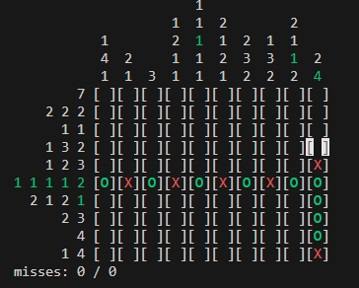

# CLI Picross in PHP

Written by James Wallace 

sausages@gmail.com

2024-04-13

## Objective

Find all the marked squares using the numbers along 
the edge of the board.  Too many misses and you lose!

## To Play
Run picross.php.

Size and number of misses are randomized each run.

## Controls
* Arrow keys move selected square
* Space key marks a square
* Enter key to guess on a square
* 'q' key to exit.

## Screenshot

